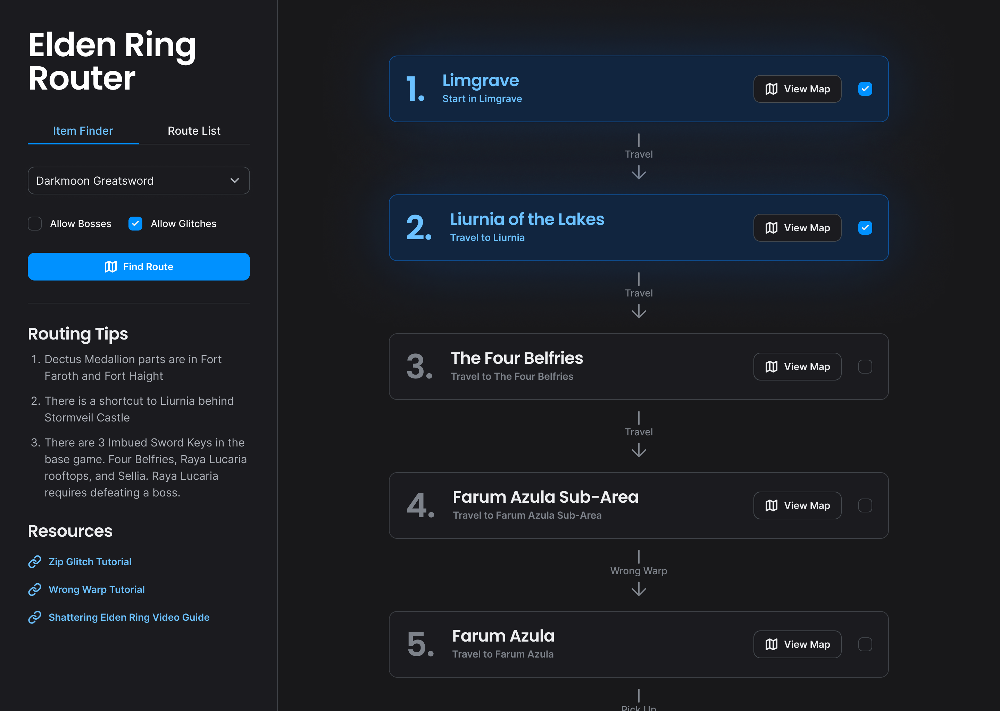

# Elden Router
A routing tool for Elden Ring.

## What is this?
Elden Ring is an open-world video game created by FromSoftware. This tool finds the shortest path to a particular item. The user can customize whether they want to have to beat a boss to get it, or whether they want to use glitches. Elden Ring is a pretty large game, and there are many ways to get to different regions especially if you factor in glitches. That's where this tool comes in.

## How does it work?
This tool uses graph theory. Locations in the world are nodes, and I use edges customized with certain attributes to connect them. Edge have attributes such as `boss_required`, `glitch_required`, or `items_required`.

First, the tool filters out all edges that don't conform to the user's selection. If the user disallows glitches, the tool filters all edges that require a glitch. Then, the tool runs the dijkstra graph algorithm to find the shortest path.

### Example Output
```typescript
// item, allowBosses, allowGlitches, itemsAcquired
getPathToItem(items.RIVERS_OF_BLOOD, false, true, [
    "DECTUS_MEDALLION_1",
    "DECTUS_MEDALLION_2",
])
```
```json
[
    {
        "from": "Limgrave",
        "to": "Liurnia",
        "metadata": [
            {}
        ]
    },
    {
        "from": "Liurnia",
        "to": "Altus Plateau",
        "metadata": [
            {
                "items_required": [
                    "DECTUS_MEDALLION_1",
                    "DECTUS_MEDALLION_2"
                ]
            }
        ]
    },
    {
        "from": "Altus Plateau",
        "to": "Leyndell Outskirts",
        "metadata": [
            {}
        ]
    },
    {
        "from": "Leyndell Outskirts",
        "to": "Consecrated Snowfield",
        "metadata": [
            {
                "glitch_required": "Zip Glitch"
            }
        ]
    },
    {
        "from": "Consecrated Snowfield",
        "to": "Hidden Path to the Haligtree",
        "metadata": [
            {},
            {}
        ]
    },
    {
        "from": "Hidden Path to the Haligtree",
        "to": "Mountaintops of the Giants",
        "metadata": [
            {
                "glitch_required": "Wrong Warp"
            }
        ]
    }
]
```

## Future Enhancements
A UI is coming soon.
